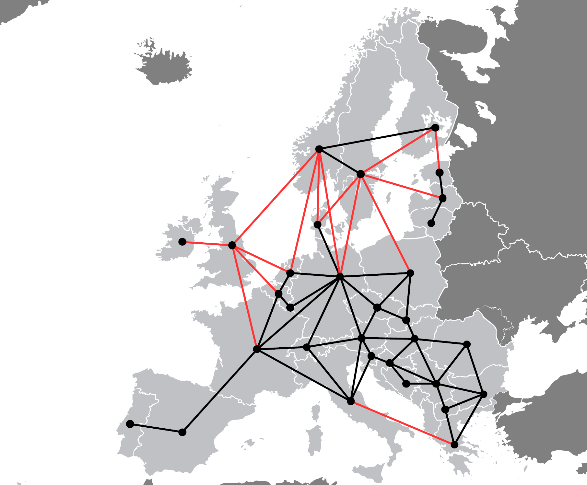

OpenEMPIRE: A capacity expansion planning model for energy systems
##################################################################

.. image:: https://readthedocs.org/projects/openempire/badge/?version=latest
    :target: https://openempire.readthedocs.io/en/latest/?badge=latest
    :alt: Documentation Status

----

   

OpenEMPIRE is a free software for running capacity expansion planning with python. The model is a stochastic linear programming model used to analyze developments of the European power market. It has been used to analyze decarbonization of the European power system focusing on the supply side of the power market. 

The purpose of the model is to support long-term capacity expansion of the power system under short-term operational uncertainty with a special focus of representing variable renewable energy sources (VRES), namely wind, solar and hydro power. Energy demand, as well as investment options for energy supply technologies, their related costs and operational characteristics, are exogenous input data in the model. The output supports decisions regarding technology choices, investment volume and investment timing with requirements of ensuring a reliable energy system at minimum cost. The model output also supports short-term operational decisions of energy system components under uncertainty. The model is subject to operational uncertainty, so the stochastic scenarios represent different realizations of the following: (1) Availability of VRES (wind and solar), (2) availability of hydro reservoirs and (3) hourly electricity loads.

Maintainers
===========

                           
OpenEMPIRE is currently mainted by `Dr. Stian Backe <https://www.ntnu.no/ansatte/stian.backe>`__, and other volunteers from the Norwegian University of Science and Technology (NTNU). See :doc:`Contributors <contributors>`.      

Origin
======
It was initially created as part of Dr. C. Skar’s `doctoral thesis <https://ntnuopen.ntnu.no/ntnu-xmlui/handle/11250/2399924>`__ supervised by `Prof. A. Tomasgard <https://www.ntnu.edu/employees/asgeir.tomasgard>`__ and Prof. G. Doorman.

The first version was written in GAMS, and rewritten into the current project with Pyomo by `Stian Backe <https://www.ntnu.no/ansatte/stian.backe>`__, and it have been extended several times since.
                             

Content
=======

.. toctree::
   :maxdepth: 2
   :numbered:
   :caption: User guide:

   user_guide/user_guide

.. toctree::
   :maxdepth: 3
   :caption: Package:

   modules
   
.. toctree::
   :maxdepth: 3
   :caption: Misc:

   contributors
   license
   release_notes

Indices and tables
==================

* :ref:`genindex`
* :ref:`modindex`
* :ref:`search`
