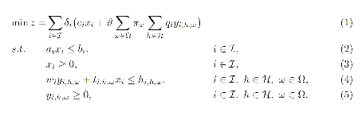
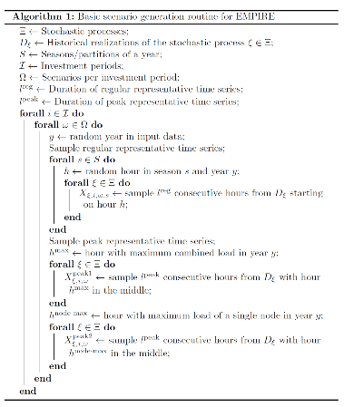
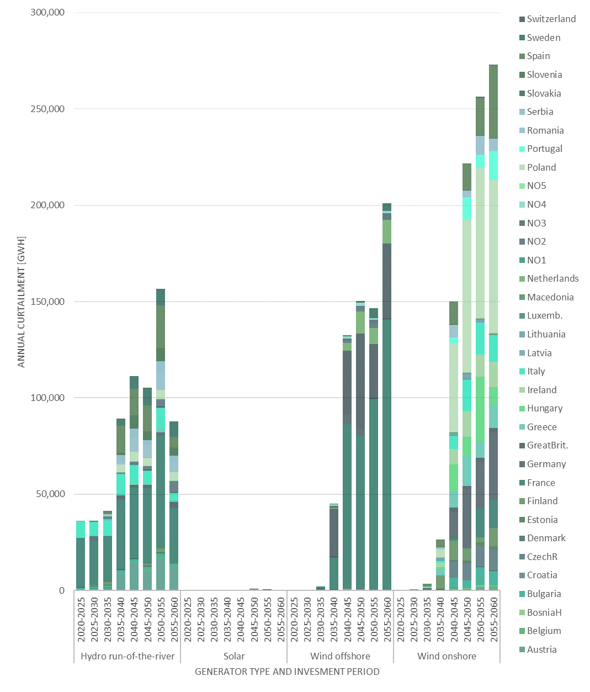
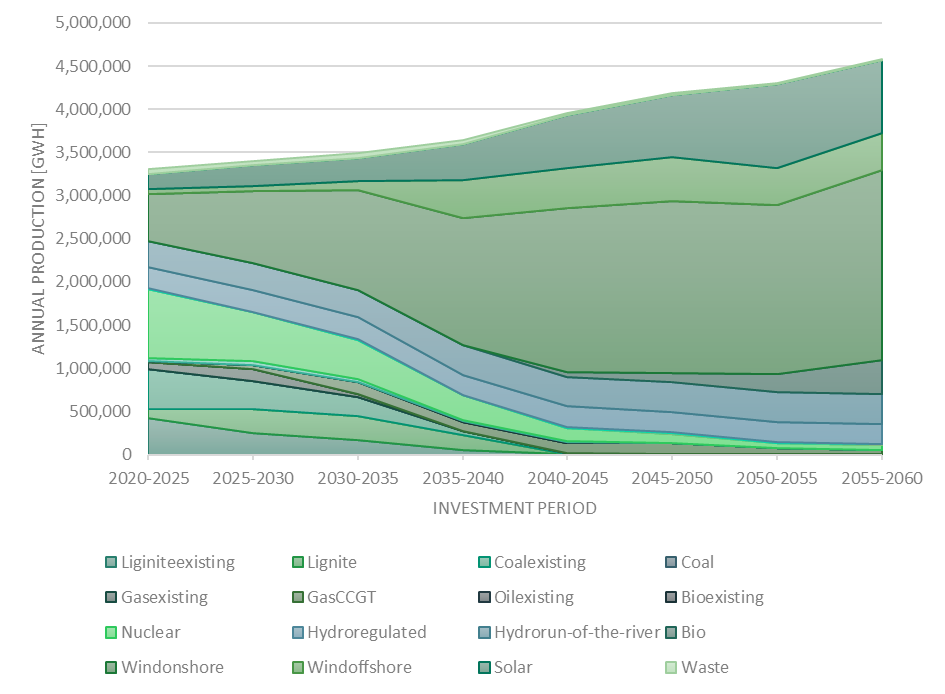
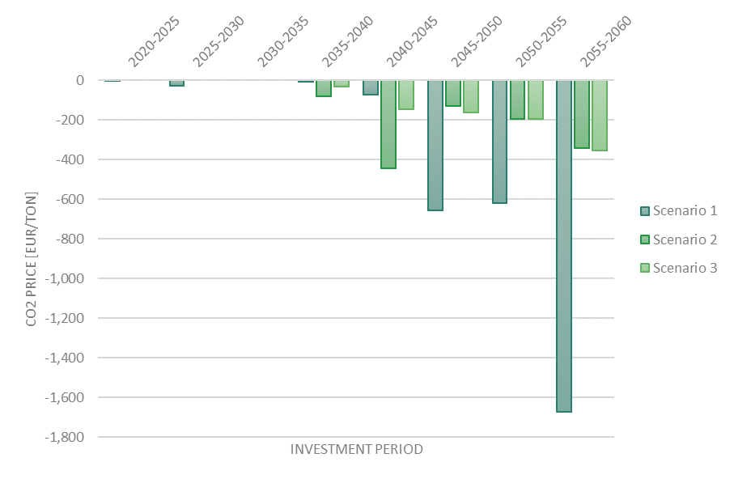
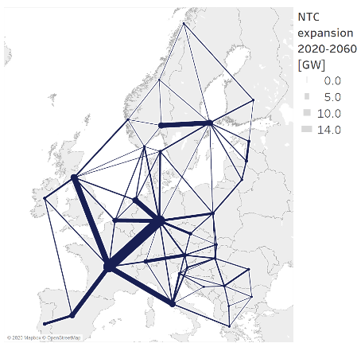

Introduction
============

This documentation contains three main parts. Firstly, where to download and run the EMPIRE model is explained. The licensing and how to contribute working on EMPIRE are also described. Furthermore, a short overview on the mathematical formulation and the preprocessed calculations is presented. Secondly, the documentation gives a detailed explanation about the input data. This contains information about the input structure, as well as different kinds of data needed to run the model. The input data can be provided as Excel files, or as .tab-files, which is also further explained in this chapter. Lastly, you will find a description of the output data and what kind results EMPIRE produces. It also shows possibilities to visualize and interpret results.

Running the EMPIRE Model
========================
This section provides information about editing and running the EMPIRE model. It shows how to download it and what software is needed. You will also find a license overview and an overview on the mathematical description.

Required Software
-----------------

The EMPIRE model is available in the Python-based, open-source optimization modelling language Pyomo. Running the model thus requires some coding skills in Python. To run the model, make sure Python, Pyomo and a third-party solver like Gurobi or CPLEX is installed and loaded to the respective computer or cluster. More information on how to install Python and Pyomo can be found `here <http://www.pyomo.org/installation>`__.

All scripts and data can be downloaded from the Git repository `OpenEMPIRE <https://github.com/ntnuiotenergy/OpenEMPIRE>`__. To download, you need to install `Git <https://git-scm.com/>`__ and `clone the repository. <https://git-scm.com/book/en/v2/Git-Basics-Getting-a-Git-Repository>`__ Note that the repository makes use of `Git Large File Storage (LFS) <https://git-lfs.github.com/>`__ which also needs to be installed for input data-files to be downloaded when cloning the repository. Once both Git and Git LFS has been successfully installed, the model is downloaded to the desired directory with the following commands in the command prompt or Git BASH:

.. code-block:: console

    $ cd <path to directory>
    $ git clone https://github.com/ntnuiotenergy/OpenEMPIRE.git

Git-Repository
--------------
EMPIRE consists of a programming script used to run the model: 

**scripts/run.py:** The main script used to run EMPIRE. This is the only script a user of EMPIRE needs to use and potentially modify.  

.. important::
   
    The main run-script (scipts/run.py), can run a small test instance of EMPIRE that usually finishes in 1-2 min. A normal test instance requires around 140 GB RAM and thus needs to be run on a high performance cluster (HPC). 

The run script uses the empire package that consists of these core modules:

**(1)	empire.py:** Contains the abstract formulation of EMPIRE in Pyomo. This script also contains code related to printing the results.

**(2)	scenario_random.py:** Generates random operational scenarios as .tab-files through sampling.

**(3)	reader.py:** Generates .tab-files input based on data provided in Excel workbooks. 

**(4)	config.py:** Defines two configuration objects used by Empire.

**(5)	model_runner.py:** Methods used for setting up an Empire run.

In addition there are modules containing input and output clients, that can be used to read and alter input data, and read ouput/results data. 

In the repository, the ‘Data handler’-folder contains the Excel workbooks that are used to store and modify input data. The workbooks are contained within folders representing instance-versions of EMPIRE, e.g. ‘europe_v50’. The ‘test’-folder contains input data for a small test-instance of EMPIRE. For more details regarding input data, see :numref:`input-data`.

Within an instance-version in the ‘Data handler’-folder, there is a folder called ‘ScenarioData’ containing large data sets used to generate stochastic scenarios in EMPIRE. If EMPIRE is run with random scenario generation, representative time series are sampled once per scenario and season for each random input parameter. For more details on scenario generation, see :numref:`scenariogeneration`.

The EMPIRE Model reads .tab-files, which provide all needed sets and input data. For editing and storing the data, excel-files are used. There are seven excel-files in total of which six contain indexed input data and one is to provide the indices/sets. The excel-files are sorted by the following categories: General data, generation data, country/node data, set/index data, transmission data, and storage data.  These files contain multiple tables regarding for example investment costs and initial capacity. 

Running 
--------

To run EMPIRE, make sure Python, `Pyomo <http://www.pyomo.org/installation>`__ and a third-party solver like Gurobi or CPLEX is installed and loaded to the respective computer or cluster. Additional third-party dependencies can be found in the ‘environtment.yml’ file. Before staring your EMPIRE-run, you should perform a test run by running the test dataset ‘scripts/run.py -d test’ to check that Pyomo and a third-party solver is installed properly. Both of the execution scripts ‘test_run.py’ and ‘run.py’ read user configuration from separate yaml files, ‘config/testrun.yaml’ and ‘config/run.yaml’, respectively. These files are used to set up a number of run-time settings, including e.g. details on which instance-version you are running, the temporal dimensions of your instance, and whether or not to generate new stochastic scenarios. An overview and description of user settings description to be confirmed/edited before running EMPIRE is presented in Table 1.

EMPIRE is run from the directory in which EMPIRE was cloned by calling the ‘run.py’-script:

.. code-block:: console

    $ C:\\Users\\name> cd <path to directory> #Change directory
    $ C:\\Users\\name\\path_to_folder> python scripts/run.py #Run the code

Note that generating scenarios and building the instance in Pyomo for a base case of EMPIRE can take around 40 min.

+--------------------------+------------+------------------+-------------------------------------------------------------------------------------------------------------------------+
| Input name               | Type       | Default          | Description                                                                                                             |
+==========================+============+==================+=========================================================================================================================+
| use_temporary_directory  | True/False | False            | If true, all instance-files related to solving EMPIRE is stored in the directory defined by temporary_directory         |
|                          |            |                  | (see below). This is useful when running a large instance of EMPIRE to avoid memory problems.                           |
+--------------------------+------------+------------------+-------------------------------------------------------------------------------------------------------------------------+
| temporary_directory      | String     | './'             | The path to which temporary files will be stored if use_temporary_directory = True; .lp-file is stored if               |
|                          |            |                  | write_in_lp_format = True; and .plk-file is stored if serialize_instance = True.                                        |
+--------------------------+------------+------------------+-------------------------------------------------------------------------------------------------------------------------+
| forecast_horizon_year    | Integer    | 2060             | The last strategic (investment) period used in the optimization run.                                                    |
+--------------------------+------------+------------------+-------------------------------------------------------------------------------------------------------------------------+
| number_of_scenarios      | Integer    | 3                | The number of scenarios in every investment period.                                                                     |
+--------------------------+------------+------------------+-------------------------------------------------------------------------------------------------------------------------+
| length_of_regular_season | Integer    | 168              | The number of hours to use in a regular season for optimization of system operation in every investment period.         |
+--------------------------+------------+------------------+-------------------------------------------------------------------------------------------------------------------------+
| discount_rate            | Float      | 0.05             | The discount rate.                                                                                                      |
+--------------------------+------------+------------------+-------------------------------------------------------------------------------------------------------------------------+
| wacc                     | Float      | 0.05             | The weighted average cost of capital (WACC).                                                                            |
+--------------------------+------------+------------------+-------------------------------------------------------------------------------------------------------------------------+
| optimization_solver      | String     | "Xpress"         | Specifies the solver. Options: “Xpress”, “Gurobi”, “CPLEX”.                                                             |
+--------------------------+------------+------------------+-------------------------------------------------------------------------------------------------------------------------+
| use_scenario_generation  | True/False | True             | If true, new operational scenarios will be generated. NB! If false, .tab-files or sampling key must be manually         |
|                          |            |                  | added to the ‘ScenarioData’-folder in the version.                                                                      |
+--------------------------+------------+------------------+-------------------------------------------------------------------------------------------------------------------------+
| use_fixed_sample         | True/False | False            | If true, operational scenarios will be generated according to a fixed sampling key located in the ‘ScenarioData’-folder | 
|                          |            |                  | to ensure the same operational scenarios are generated.                                                                 |
+--------------------------+------------+------------------+-------------------------------------------------------------------------------------------------------------------------+
| load_change_module       | True/False | False            |                                                                                                                         |
+--------------------------+------------+------------------+-------------------------------------------------------------------------------------------------------------------------+
| filter_make              | True/False | False            | Prepare strata SGR                                                                                                      |
+--------------------------+------------+------------------+-------------------------------------------------------------------------------------------------------------------------+
| filter_use               | True/False | False            | Use strata SGR                                                                                                          |
+--------------------------+------------+------------------+-------------------------------------------------------------------------------------------------------------------------+
| copula_clusters_make     | True/False | False            | Prepare copula-strata SGR                                                                                               |
+--------------------------+------------+------------------+-------------------------------------------------------------------------------------------------------------------------+
| copula_clusters_use      | True/False | False            | Use copula-strata SGR                                                                                                   |
+--------------------------+------------+------------------+-------------------------------------------------------------------------------------------------------------------------+
| copulas_to_use           | List       | ["electricload"] | Emprical copula in copula-strata: ["electricload", "hydroror", "hydroseasonal", "solar", "windoffshore", "windonshore"] |
+--------------------------+------------+------------------+-------------------------------------------------------------------------------------------------------------------------+
| n_cluster                | Integer    | 10               | Number of clusters for stratified sampling step of strata/copula-strata SGRs                                            |
+--------------------------+------------+------------------+-------------------------------------------------------------------------------------------------------------------------+
| moment_matching          | True/False | False            | Moment-matching SGR                                                                                                     |
+--------------------------+------------+------------------+-------------------------------------------------------------------------------------------------------------------------+
| n_tree_compare           | Integer    | 20               | Scenario trees compared in moment-matching SGR                                                                          |
+--------------------------+------------+------------------+-------------------------------------------------------------------------------------------------------------------------+
| use_emission_cap         | True/False | True             | If true, emissions in every scenario are capped according to the specified cap in ‘General.xlsx’. If false, the         |
|                          |            |                  | CO2-price specified in ‘General.xlsx’ applies.                                                                          |
+--------------------------+------------+------------------+-------------------------------------------------------------------------------------------------------------------------+
| compute_operational_duals| True/False | True             | If true, resolve empire with fixed investment variables and write new duals                                             |
+--------------------------+------------+------------------+-------------------------------------------------------------------------------------------------------------------------+
| print_in_iamc_format     | True/False | True             | If true, selected results are printed on the standard IAMC-format in addition to the normal EMPIRE print.               |
+--------------------------+------------+------------------+-------------------------------------------------------------------------------------------------------------------------+
| write_in_lp_format       | True/False | False            | If true, the solver-file will be saved. Useful for debugging.                                                           |
+--------------------------+------------+------------------+-------------------------------------------------------------------------------------------------------------------------+
| serialize_instance       | True/False | False            | If true, instance will be saved/pickled. Useful for printing alternative results.                                       |
+--------------------------+------------+------------------+-------------------------------------------------------------------------------------------------------------------------+
| north_sea                | True/False | False            | Whether the north sea is modelled or not.                                                                               |
+--------------------------+------------+------------------+-------------------------------------------------------------------------------------------------------------------------+
| leap_years_investment    | Integer    | 5                | Number of years per period.                                                                                             |
+--------------------------+------------+------------------+-------------------------------------------------------------------------------------------------------------------------+
| time_format              | String     | "%d/%m/%Y %H:%M" | Time format for scenario data files.                                                                                    |
+--------------------------+------------+------------------+-------------------------------------------------------------------------------------------------------------------------+

View input and output data
--------------------------
For each Empire run, a input and output folder are created in the `./Results` folder. This makes it easier to compare different model runs, as both inputs and outputs are explicitly defined. The results can also be analyzed with a `streamlit <https://streamlit.io/>`__ app that visualize both the inputs and outputs for the different runs. To start the streamlit app run the following, 

.. code-block:: console

   $ C:\\Users\\name\\path_to_folder> streamlit run app/main.py

Licensing
---------

The EMPIRE model and all additional files in the git repository are licensed under the MIT license. In short, that means you can use and change the code of EMPIRE. Furthermore, you can change the license in your redistribution but must mention the original author. We appreciate if you inform us about changes and send a merge request via git.

For further information please read the LICENSE file, which contains the license text, or go to https://opensource.org/licenses/MIT

Mathematical Description
========================

EMPIRE is a multi-horizon stochastic linear program, and it has been designed to support capacity expansion of the power system. The model represents a network of nodes and arcs where decisions are made in two temporal scales: investment time steps and operational time steps. Operational decisions are subject to uncertainty that is discretized in several stochastic scenarios.

The abstract stochastic programming model can be formulated in the following way:

where the set :math:`\mathcal{I}` represents investment periods, the set :math:`\mathcal{H}` represents operational periods and the set :math:`\Omega` represents a set of operational scenarios. The variables :math:`x_{i}` represent investment decisions in investment period :math:`i \in I`, while the variables :math:`y_{i,h,\omega}` represent operational decisions in operational period :math:`h \in \mathcal{H}` and scenario :math:`\omega \in \Omega` within investment period :math:`i \in \mathcal{I}`. These variables are also dependent on node (location) and asset type (generator, storage, transmission).

The expression (1) is the objective function identifying total costs for investing and operating assets in the system. The total costs are quantified by summing over all time periods, both investment and operational. The term :math:`\delta_{i} = (1 + r)^{- n(i - 1)}` discounts all future costs at an annual discount rate of :math:`r` with :math:`n` years in between each investment period such that all costs are given with respect to the value in the first investment period. The term :math:`\vartheta = \alpha\sum_{j = 0}^{n}(1 + r)^{- j}` scales operational costs to annual values through :math:`\alpha` and discounts this annual operational cost :math:`n` years ahead (until the next investment period). The input :math:`c_{i}` represent investment costs and :math:`q_{i}` represent operational costs in investment period :math:`i \in \mathcal{I}`. Since the operational decisions are subject to uncertainty, the operational costs in (1) represent the *expected* operational costs by scaling with :math:`\pi_{\omega}` representing the probability that scenario :math:`\omega \in \Omega` will occur.

Constraints (2)-(3) make sure investments in all assets are bounded, that the lifetime of the asset is considered across the investment periods and that there are no negative investments. Constraints (4)-(5) make sure operation of assets is bounded by investment decisions and asset availability, that supply balances demand (and possibly lost load), that energy levels in storages is balanced, that thermal generators have limited up-ramping capabilities, that policies (e.g. emission caps) are respected, and that operation of assets is not negative. The input :math:`w_{i}` represent type dependent operational specifications for assets, while :math:`t_{i,h,\omega}` represent scenario dependent operational specifications. The latter input data affect the value of investment decisions in different operational scenarios.

For a more detailed mathematical formulation, see:

`Skar et.al., “A multi-horizon stochastic programming model for the
European power system”, CenSES working paper 2, ISBN: 978-82-93198-13-0,
2016. <https://www.ntnu.no/documents/7414984/202064323/1_Skar_ferdig.pdf/855f0c3c-81db-440d-9f76-cfd91af0d6f0>`__

The EMPIRE formulation supports investment decisions in power generation, storage, and transmission with an objective of minimizing total system cost, which means the model simulates perfect competition. The strength of the model is that these investment decisions are made linked with the chronological operation of the assets to satisfy demand, and that the chronological operations are subject to uncertainty.

EMPIRE is generally used to investigate pathways for decarbonizing the power sector in Europe. However, this is instance specific, meaning the abstract model could be used for other places than Europe or other sectors than power that can be modelled as a network flow, e.g. capacity expansion of a gas system.

.. _input-data:

Input Data
==========

The EMPIRE Model reads .tab-files, which provide all needed sets and input data. For editing and storing the data, excel-files are used.

There are seven excel-files in total of which six contain indexed input data and one is to provide the indices/sets. The excel-files are sorted by the following categories: General data, generation data, country/node data, set/index data, transmission data, and storage data. These files contain multiple tables regarding for example investment costs and initial capacity. In the following, the content of the excel-files is described. The general structure of all files is given before each file and its content is presented.

Structure of the input files
----------------------------

We differentiate the structure of the data files and the set/index file. The difference between these two file types is that the data files have indices while the set file defines the indices. Every excel-file contains multiple worksheets. In every sheet, there is one data table and some additional data.

For the data files, the first row in every sheet is for the source, i.e. where the data is from. The second row provides a brief description of the data and its role in EMPIRE. The rows beneath contain the table with header and values. Therefore, the tables have the structure like the table beneath with N index columns and a value column:

+-----------------------+-------+------------------------+------------+
| Source                |       |                        |            |
+=======================+=======+========================+============+
| Description           |       |                        |            |
+-----------------------+-------+------------------------+------------+
| Column Name 1         | (…)   | Column Name N          | Value      |
+-----------------------+-------+------------------------+------------+
| Index 1.1             | (…)   | Index N.1              | value 1    |
+-----------------------+-------+------------------------+------------+
| Index 1.2             | (…)   | Index N.2              | value 2    |
+-----------------------+-------+------------------------+------------+

For the set/index files, the sheets are separated by groups. There are two different kinds of sheets. In the first kind, columns are filled with the sets/indices, and there are no source or description rows. Every sheet contains a group and every column a type of this group (e.g. group ‘Generator’ with categories of generator types). The other kind of set/index sheets contain tuples defining subsets or sets with double index, e.g. transmission connections between countries.

Description of the Input Files
------------------------------

Sets
~~~~

The set file contains indices for parameters and variables used in the model. Each sheet contains a group of sets/indices or double index sets. One can add values to these columns to expand the dimensions of an instance. Indices defined here must be consistent with the other data files or the user input in the ‘run.py’-script.

In the following, the five different groups of sets/indices and a short description of them is given:

-  **Nodes**

   This sheet contains one column. The name of the column is ‘Node’ and it contains all countries, regions, or offshore areas that are used in the model

-  **Storage**

   This sheet contains two columns:

   -  **Storage:** All types of storages.

   -  **Dependent Storage:** Storage types where charging/discharging capacity is dependent on the energy storage capacity

-  **Technology**

   This sheet contains all the technology groups for generators in one column. The technology groups are used to put resource restrictions on generator types using the same resource.

-  **Generators**

   This sheet contains all types of generators that can be used in the model. They may rely on the same technology.

   -  **Generator:** All types of used generators.

   -  **Hydro Generator:** All generators using hydro power.

   -  **Hydro Generator with Reservoir:** All generators using hydro power that can be regulated.

   -  **Thermal Generators:** All generators incinerating fuel to produce electricity. These generators are subject to ramping constraints.

-  **Line Type**

   This sheet contains different transmission line types in one column

..

   Additionally, there are sheets for defining double index sets. Each sheet contains two or three columns:

-  **Storage at Nodes:** Available storages per country

-  **Directional Lines:** Existing/possible connections between countries

-  **Line Type of Directional Lines:** Define the line type of the transmission connections

-  **Generators of Node:** Available generators per country

-  **Generators of Technologies:** Categorize generator type by technology (resource)

..

   Lastly, there is a sheets for defining the coordinates of the nodes, used for illustrative purposes:

-  **Coords:** Coordinates in latitude and longitude for the nodes. 

Generator
~~~~~~~~~

The file ‘Generator.xlsx’ contains different data regarding the generator technologies:

-  **Capital Costs**

   *Source:* `PRIMES 2018 <https://ec.europa.eu/energy/sites/ener/files/documents/2018_06_27_technology_pathways_-_finalreportmain2.pdf>`__

   -  Capital costs per kW of all generator types in all investment periods in three columns:

      -  Index: Generator type
      -  Index: Period
      -  Value: Total capital costs in EUR per kW (default: 0)

-  **Fixed OM Costs**

   *Source:* `PRIMES 2018 <https://ec.europa.eu/energy/sites/ener/files/documents/2018_06_27_technology_pathways_-_finalreportmain2.pdf>`__

   -  Fixed annual operation and maintenance costs for generator technologies in EUR per kW-year in three columns:

      -  Index: Generator type
      -  Index: Period
      -  Value: Fixed OM Costs in EUR per kW (default: 0)

-  **Variable OM Costs**

   *Source:* `PRIMES
   2018 <https://ec.europa.eu/energy/sites/ener/files/documents/2018_06_27_technology_pathways_-_finalreportmain2.pdf>`__

   -  Operation dependent operation and maintenance costs for generator types in EUR per MWh/h in three columns:

      -  Index: Generator type
      -  Index: Period
      -  Value: Variable OM Costs in EUR per MWh (default: 0)

-  **Fuel Costs**

   *Source:* `EC decarbonisation scenario 2016 <https://doi.org/10.1016/j.esr.2018.06.009>`__

   -  Period dependent fuel costs for generator types in EUR per GJ in three columns:

      -  Index: Generator Technology
      -  Index: Period
      -  Value: Fuel Costs in EUR per GJ (default: 0)

-  **CCS Costs TS Variable**

   *Source:* `Zero Emission Platform (ZEP) <https://www.etipbioenergy.eu/supporting-initiatives-and-platforms/related-european-technology-platforms-and-jtis/zero-emissions-platform>`__

   -  Costs of transporting and storing captured CO2 in EUR per tonCO2eq. in two columns:

      -  Index: Period
      -  Value: CCS TS costs in euro per tCO2 (default: 0)

-  **Efficiency**

   *Source:* `PRIMES 2018 <https://ec.europa.eu/energy/sites/ener/files/documents/2018_06_27_technology_pathways_-_finalreportmain2.pdf>`__

   -  Efficiency of converting fuel to electricity for generator types in each period in three columns:

      -  Index: Generator type
      -  Index: Period
      -  Value: Generator Efficiency in MWh-electricity per MWh-fuel (default: 1)

-  **Ref Initial Cap**

   *Source:* `Statistical factsheet 2018 (ENTSO-E) <https://eepublicdownloads.azureedge.net/clean-documents/Publications/Statistics/Factsheet/entsoe_sfs2018_web.pdf>`__

   -  The capacity in the reference investment period in three columns:

      -  Index: Node
      -  Index: Generator type
      -  Value: Generator Reference Initial Capacity in MW (default: 0)

-  **Scale Factor Initial Cap**

   *Source: JCR 2009*

   -  The share of capacity that retired compared to the reference period in three columns (value = 0 means no retirement of Ref Initial Cap):
      -  Index: Generator Technology
      -  Index: Period
      -  Value: Generator Retirement Factor Initial Capacity (default: 0)

-  **Initial Capacity**

   **(NB! Set to default (0) when using ‘Ref Initial Cap’ and ‘Scale
   Factor Initial Cap’)**

   -  The initial capacity in all investment periods in four columns:

      -  Index: Node
      -  Index: Generator type
      -  Index: Period
      -  Value: Generator initial Capacity in MW (default: 0)

-  **Maximum Built Capacity**

   -  Use to restrict the capacity expansion of certain technologies. The generation capacity that can maximally be built in an investment period for any country in four columns:

      -  Index: Node
      -  Index: Technology **(NB! Technology, NOT generator type)**
      -  Index: Period
      -  Value: Maximum Built Capacity in MW (default: 500 000)

-  **Maximum Installation Capacity**

   *Source: National Renewable Energy Action Plan (NREAP), Eurelectric,
   ENTSO-E + more (see workbook)*

   -  The maximum capacity that can exist of a generator technology
      (resource limit) in any country or investment period in three
      columns:

      -  Index: Node
      -  Index: Technology **(NB! Technology, NOT generator type)**
      -  Value: Maximum Installed Capacity in MW (default: 0)

-  **Ramp Rate**

   *Source: IEA, NEA*

   -  The maximum change of output from one hour to the next hour for thermal generators in two columns:

      -  Index: Thermal Generator
      -  Value: Ramp Rate (default: 0)

-  **Generator Availability**

   **(NB! Set to default (0) when the generator have stochastic availability)**

   *Source: IEA, NEA*

   -  The availability factor as a share of installed capacity for all defined generators in two columns:

      -  Index: Generator
      -  Value: Availability (default: 0)

-  **CO2 Content**

   *Source:* `IPCC <https://www.ipcc-nggip.iges.or.jp/public/2006gl/pdf/2_Volume2/V2_2_Ch2_Stationary_Combustion.pdf>`__

   -  The CO2 intensity of generator type depending on fuel in two columns:

      -  Index: Generator type
      -  Value: CO2 Content in tCO2/GJ (default: 0)

-  **Lifetime**

   *Source:* `PRIMES 2018 <https://ec.europa.eu/energy/sites/ener/files/documents/2018_06_27_technology_pathways_-_finalreportmain2.pdf>`__

   -  The lifetime of a generator type in years in two columns:

      -  Index: Generator type
      -  Value: Lifetime in years (default: 0)

Nodes
~~~~~

The file ‘Node.xlsx’ contains the data specific to all specified countries:

-  **Electric Annual Demand**

   *Source:* `EC decarbonisation scenario 2016 <https://doi.org/10.1016/j.esr.2018.06.009>`__ *+ NVE*

   -  The annual demand in nodes used to adjust hourly load profiles for future investment periods in three columns:

      -  Index: Node
      -  Index: Period
      -  Value: Annual electric demand in MWh (default: 0)

-  **Node Lost Load Cost**

   *Source:* `London School of Economics <https://www.ofgem.gov.uk/ofgem-publications/82293/london-economics-value-lost-load-electricity-gbpdf>`__

   -  The cost of not generating electricity in an hour in three columns:
      -  Index: Node
      -  Index: Period
      -  Value: Node Lost Load Cost in EUR (default: 22 000)

-  **Hydro Generator Maximum Annual Production**

   *Source: National Renewable Energy Action Plan (NREAP) from EEA, ENSTO-E, Eurelectric*

   -  The maximum production of all regulated hydro generators in a country per year in two columns:

      -  Index: Node
      -  Value: Max production in MWh

General
~~~~~~~

The file ‘General.xlsx’ contains the scale factor for all seasons and data related to emission policies:

-  **Season Scale**

   -  The scaling of each representative season to add up to a full year in two columns:

      -  Index: Season
      -  Value: Season Scale (default: 1)

-  **CO2 Cap**

   **(NB! If EMISSION_CAP = True)**

   *Source:* `A Clean Planet for all - A European strategic long-term vision for a prosperous, modern, competitive and climate neutral economy <https://ec.europa.eu/clima/policies/strategies/2050_en>`__

   -  The maximum allowed annual emissions for all countries combined in any scenario of an investment period in two columns:

      -  Index: Period
      -  Value: CO2 Cap in Mton CO2 per year (default: 5 000)

-  **CO2 Price**

   **(NB! If EMISSION_CAP = False)**

   *Source:* `EC decarbonisation scenario 2016 <https://doi.org/10.1016/j.esr.2018.06.009>`__

   -  The assumed CO2 price adding to the operational costs of CO2 emitting generators in two columns:

      -  Index: Period
      -  Value: CO2 price in EUR per tCO2 (default: 0)

Storages
~~~~~~~~

The file ‘Storage.xlsx’ contains data regarding the storage technologies:

-  **Power Initial Capacity**

   *Source:* `Statistical factsheet 2018 (ENTSO-E) <https://eepublicdownloads.azureedge.net/clean-documents/Publications/Statistics/Factsheet/entsoe_sfs2018_web.pdf>`__

   -  The initial capacity of charging/discharging storage capacity for a period in four columns:

      -  Index: Nodes
      -  Index: Storage Types
      -  Index: Period
      -  Value: Initial Capacity in MW (default: 0)

-  **Power Capital Costs**

   *Source: Battery cost medish (Cole et al 2016)*

   -  The capital cost for investing in charging/discharging storage capacity in three columns:

      -  Index: Storage Type
      -  Index: Period
      -  Value: Capital Cost in Euro per kW (default: 0)

-  **Power Fixed OM Costs**

   *Source: Battery cost medish (Cole et al 2016)*

   -  The fixed operation and maintenance cost for investing in charging/discharging storage capacity in three columns:

      -  Index: Storage Type
      -  Index: Period
      -  Value: Fixed OM Costs in Euro per kW (default: 0)

-  **Power Max Built Capacity**

   -  The maximum capacity of charging/discharging storage capacity that can be built in a period in four columns:

      -  Index: Nodes
      -  Index: Storage Types
      -  Index: Period
      -  Value: Max Built Capacity in MW (default: 500 000)

-  **Power Max Installed Capacity**

   *Source: Eurelectric, ISO, ENTSO-E, ZEP (+50% of installed capacity)*

   -  The maximum installed charging/discharging storage capacity in any period in three columns:

      -  Index: Nodes
      -  Index: Storage Types
      -  Value: Max installed Capacity in MW (default: 0)

-  **Energy Capital Costs**

   *Source: Battery cost medish (Cole et al 2016)*

   -  The capital cost for investing in energy storage capacity in three columns:

      -  Index: Storage Type
      -  Index: Period
      -  Value: Capital Cost in EUR per kWh (default: 0)

-  **Energy Fixed OM Costs**

   *Source: Battery cost medish (Cole et al 2016)*

   -  The fixed operation and maintenance cost for investing in energy storage capacity in three columns:
      
      -  Index: Storage Type
      -  Index: Period
      -  Value: Fixed OM Costs in EUR per kWh (default: 0)

-  **Energy Initial Capacity**

   *Source: Eurelectric, ISO, ENTSO-E, ZEP*

   -  The initial energy storages capacity in a period in four columns:

      -  Index: Nodes
      -  Index: Storage Types
      -  Index: Period
      -  Value: Initial Capacity in MWh (default: 0)

-  **Energy max Built Capacity**

   -  The maximum energy storage capacity that can be built in a period in four columns:

      -  Index: Nodes
      -  Index: Storage Types
      -  Index: Period
      -  Value: Max Built Capacity in MWh (default: 500 000)

-  **Energy Max Installed Capacity**

   *Source: Eurelectric: 'Hydro in Europe: Powering Renewables' (+10% of existing capacity)*

   -  The maximum installed energy storage capacity in any period in three columns:

      -  Index: Nodes
      -  Index: Storage Types
      -  Value: Max installed Capacity in MWh (default: 0)

-  **Storage Initial Energy Level**

   -  The initial energy level of a storage as a percentage of the installed energy capacity in two columns:

      -  Index: Storage Type
      -  Value: Initial Energy Level as percentage of Installed Energy Capacity (default: 0)

-  **Storage Charge Efficiency**

   -  The efficiency of charging a storage (non-spillage during charging) in two columns:

      -  Index: Storage Type
      -  Value: Storage Charging Efficiency (default: 1)

-  **Storage Discharge Efficiency**

   -  The efficiency of discharging a storage (non-spillage during discharging) in two columns:

      -  Index: Storage Type
      -  Value: Storage Discharging Efficiency (default: 1)

-  **Storage Power to Energy**

   -  The required ratio between installed power and energy storage for dependent storage in two columns:

      -  Index: Dependent Storage Type
      -  Value: Storage Ratio (default: 1)

-  **Storage Bleed Efficiency**

   -  The hourly percentage of spillage (self-discharge) in two columns (value = 1 means no self-discharge):

      -  Index: Storage Type
      -  Value: Storage Bleed Efficiency (default: 1)

-  **Lifetime**

   *Source: Battery cost medish (Cole et al 2016)*

   -  Lifetime of storage types in years in two columns:

      -  Index: Storage Type
      -  Value: Lifetime in years (default: 0)

Transmission
~~~~~~~~~~~~

The file ‘Transmission.xlsx’ contains the data specific to all transmission connections between countries:

-  **Line Efficiency**

   -  The percentage of transmission that reaches destination in any time step in three columns:

      -  Index: From Node
      -  Index: To Node
      -  Value: Line Efficiency (default: 0.97)

-  **Max Install Capacity**

   *Source: ENTSO-E*

   -  The maximum allowed capacity of transmission between nodes in the given investment period in four columns:

      -  Index: From Node
      -  Index: To Node
      -  Index: Period
      -  Value: Max Install Capacity in MW (default: 0)

-  **Maximum Built Capacity**

   *Source: Distances defined by map (approx cog, normalized st BE-NL is 175)*

   -  The maximum transmission capacity that can be built in a period in four columns:

      -  Index: From Node
      -  Index: To Node
      -  Index: Period
      -  Value: Transmission Maximum Built Capacity in MW (default: 0)

-  **Length**

   -  The length of net transfer capacity between two nodes in three columns:

      -  Index: From Node
      -  Index: To Node
      -  Value: Line length in km (default: 0)

-  **Line Type Capital Costs**

   *Source: A scenario analysis for an optimal RES integration into the European transmission grid up to 2050*

   -  This sheet contains the cost per MW-km of investing in a transmission with a given line type in three columns:

      -  Index: Line Type
      -  Index: Period
      -  Value: Type Capital Costs in EUR per MW-km (default: 0)

-  **Line Type Fixed OM Cost**

   *Source: Assumed 5 % of capital cost (see Type Capital Cost)*

   -  The cost for operation and maintenance of transmission line types in three columns:

      -  Index: Line Type
      -  Index Period
      -  Value: Fixed OM Cost in EUR per MW (default: 0)

-  **Initial Capacity**

   *Source: SUSPLAN, ENTSO-E*

   -  The initial transmission capacity in a period in four columns:

      -  Index: From Node
      -  Index: To Node
      -  Index: Period
      -  Value: Transmission Initial Capacity in MW (default: 0)

-  **Lifetime**

   -  The lifetime of transmission Lines in years in three columns:

      -  Index: From Node
      -  Index: To Node
      -  Value: Lifetime in years (default: 40)

Calculation
-----------

Before building the model, calculations are performed with parts of the input data. The calculation procedures are part of the ‘Empire.py’-script. The most relevant functions are described here to explain how to the final input data is calculated\ *.*

-  **prepSceProbab_rule**

   Calculates an equiprobable scenario probability depending on the number of scenarios, :math:`|\Omega|`, per investment period:

.. math:: \pi_{\omega} = \frac{1}{|\Omega|}

-  **prepInvCost_rule**

   Calculates investment costs, :math:`{InvCost}_{p,a}`, per MW for generation-, storage-, or transmission asset :math:`a` in period\ :math:`\ p`:

.. math:: {InvCost}_{p,a} = \frac{1 - (1 + \delta)^{- min\left( \tau\left( |P| - p + 1 \right),\ \ \ L_{a} \right)}}{1 - \frac{1}{1 + \delta}}{AnnualCost}_{p,a} \bullet 1000

Where:

.. math:: {AnnualCost}_{p,a} = \frac{WACC}{1 - (1 + WACC)^{- L_{a}}}CapCost_{p,a} + FixOMCost_{p,a}

In the :math:`{InvCost}_{p,a}` calculation, :math:`\delta` is the discount rate, :math:`\tau` is the number of leap years in between each investment period, :math:`|P|` is the total number of investment periods, and :math:`L_{a}` is the lifetime of the asset in years. Note that the discount term makes sure investment costs are not paid for asset lifetime that is not considered by the model horizon :math:`|P|`. The :math:`CapCost_{p,a}` for any transmission connection is also scaled with its length.

For CCS generators, additional fixed transportation- and storage costs, :math:`{FixT\& SCost}_{p,a}`, apply to the investment costs to ensure the handling of the captured CO2:

.. math:: {AnnualCostCCS}_{p,a} = {AnnualCost}_{p,a} + {FixT\& SCost}_{p,a} \bullet {CO2Rem}_{p,a} \bullet \frac{3.6 \bullet {CO2}_{p,a}}{\varepsilon_{a}}

In the :math:`{AnnualCostCCS}_{p,a}` calculation, :math:`{CO2Rem}_{p,a}` is the fraction of CO2 removed by CCS generator :math:`a`, :math:`{CO2}_{p,a}` is the CO2 factor in tCO2/GJ (there is 3.6 GJ/MWh), and :math:`\varepsilon_{a}` is the fuel conversion efficiency of the generator.

-  **prepOperationalCostGen_rule**

   Calculates the generator operational costs, :math:`{OpCost}_{p,g}`, for generator :math:`g` in period :math:`p`:

.. math:: {OpCost}_{p,g} = VarOMCost_{g} + \frac{3.6}{\varepsilon_{g}}\left( FuelCost_{p,g} \right)

Where :math:`VarOMCost_{g}` is the variable operation and maintenance cost of the generator, :math:`\varepsilon_{g}` is the fuel efficiency of the generator,\ :math:`\ FuelCost_{p,g}` is the fuel cost in EUR/GJ (there is 3.6 GJ/MWh).

If **EMISSION_CAP=False**, CO2 costs also apply:

.. math:: {OpCostCO2}_{p,g} = {OpCost}_{p,g} + {\frac{3.6}{\varepsilon_{g}}(CO2}_{p,g} \bullet {CO2Price}_{p,g})

where :math:`{CO2}_{p,a}` is the CO2 factor in tCO2/GJ, and :math:`{CO2Price}_{p,g}` is the CO2 price in EUR/tCO2.

For CCS generators, additional costs for handling transportation- and storage of CO2, :math:`{VarT\& SCost}_{p,g},\ `\ apply:

.. math:: {OpCostCCS}_{p,g} = {OpCost}_{p,g} + {\frac{3.6}{\varepsilon_{g}}((1 - {CO2Rem}_{p,g}) \bullet CO2}_{p,g} \bullet {CO2Price}_{p,g}

.. math:: + \ {CO2Rem}_{p,g} \bullet {{CO2}_{p,g} \bullet VarT\& SCost}_{p,g})

-  **prepInitialCapacityNodeGen_rule**

   Calculates initial capacity, :math:`InitCap_{n,g,p}`, of generator type :math:`g` in node :math:`n` and period :math:`p`:

.. math:: InitCap_{n,g,p} = RefInitCap_{n,g}(1 - ScaleInitCap_{n,g,p})

Where :math:`RefInitCap_{n,g}` is the reference initial capacity and :math:`ScaleInitCap_{n,g,p}` is the share of the reference initial capacity that has retired in that period.

-  **prepSload_rule**

   Calculates the future electricity load, :math:`\xi_{n,h,i,\omega}^{\text{load}}`, in node :math:`n`, operational time step :math:`h`, scenario :math:`\omega`, and period :math:`i`:

.. math:: \xi_{n,h,i,\omega}^{\text{load}} = \xi_{n,h,1,\omega}^{\text{load}} - \xi_{n,1,\omega}^{\text{load,avg}} + \xi_{n,i}^{\text{dem,avg}}

Where :math:`\xi_{n,h,1,\omega}^{\text{load}}` is the reference load, :math:`\xi_{n,1,\omega}^{\text{load,avg}}` is the average reference load for all operational time steps in scenario :math:`\omega` and period :math:`i`, and :math:`\xi_{n,i}^{\text{dem,avg}}` is the average demand per operational time step based on the future estimate for annual electricity demand (see Section 3.2.3).

.. _scenariogeneration:

Scenario generation
===================

This section explains the scenario generation routine implemented for the OpenEMPIRE. The routine is written in the ‘scenario_random.py’-script, and it samples chronological time steps from the raw data in the ‘ScenarioData’ folder in the version-folder in the ‘Data handling’ folder for the version to be solved. The routine is activated by setting **use_scenario_generation = True** in the file ‘config/run.yaml’.

The scenario generation routine works as follows:

There are six stochastic processes that are realized in each scenario generated by the scenario generation routine:

-  The hourly availability of solar, wind onshore, wind offshore, and hydro run-of-river plants (four processes)
-  The seasonal availability of hydro regulated (one process)
-  The electric load profile (one process)

The six processes have a new realization for every operational time step, every investment period, every node, and every scenario. The new realizations are ensured by randomly picking a year to sample data for the stochastic processes. Hours are also picked random within the random year to construct representative time periods. There are more data for solar and wind than for load and hydro, hence the random year selection is separate for solar and wind (three stochastic processes) and hydro and load (three stochastic processes).

Prior to the sampling, the scenario generation routine makes four equal partitions of each year (three months each), and each partition represents a regular season that is realized for every scenario. Each regular season has a duration of one complete week, i.e. :math:`7 \bullet 24 = 168` representative hours.

In addition, there are two peak seasons, peak1 and peak2, that are also part of every scenario. The first season is sampled based on the highest combined load of all nodes in the randomly selected year. The second season is sampled based on the highest load of a single node in the randomly selected year. Since there is a limited number of years to sample from, peak seasons are likely to be the same in different scenarios and investment periods.

Output Data
===========

Output Files
------------

EMPIRE’s standard output encompasses nine .csv files Each file contains one or several tables with figures ordered by indices, e.g. year, technology, country, etc. This section describes the content of the result files.

results_objective.csv
~~~~~~~~~~~~~~~~~~~~~

Prints the objective function value. Also available in the logfile.

results_output_curtailed_prod.csv
~~~~~~~~~~~~~~~~~~~~~~~~~~~~~~~~~

Curtailed production shows the expected amount of curtailed energy from variable renewable energy sources per year in GWh in four columns:

-  Index: Node
-  Index: RESGeneratorType
-  Index: Period
-  Value: ExpectedAnnualCurtailment_GWh

results_output_EuropePlot.csv
~~~~~~~~~~~~~~~~~~~~~~~~~~~~~

Results for purposes of easy and fast visualization. There are five tables in this file:

-  *genInstalledCap_MW*

   Installed capacity for the whole Europe, per investment period and generator type:

   -  Rows: Period
   -  Columns: Generator types
   -  Value: Installed Capacity in MW for all nodes

-  *genExpectedAnnualProduction_GWh*

   Expected annual energy production for the whole Europe, per investment period and generator type:

-  Rows: Period
-  Columns: Generator types
-  Value: Expected annual electricity output in GWh for all nodes
-  *storPWInstalledCap_MW*

   Installed storage capacityfor the whole Europe, per investment period and storage type:

   -  Rows: Period
   -  Columns: Storage types
   -  Value: Installed charging/discharging capacity in MW for all nodes

-  *storENInstalledCap_MW*

   Installed energy storage capacity for the whole Europe, per investment period and storage type:

   -  Rows: Period
   -  Columns: Storage types
   -  Value: Installed energy storage capacity in MW for all nodes

-  *storExpectedAnnualDischarge_GWh*

   Expected annual storage discharge for the whole Europe, per investment period and storage type:

   -  Rows: Period
   -  Columns: Storage types

-  Value: Expected annual discharge volume in GWh for all nodes

results_output_EuropeSummary.csv
~~~~~~~~~~~~~~~~~~~~~~~~~~~~~~~~

Results for Europe as a whole. There are three tables:

-  *Europe-wide general values per year scenario:*

   -  Index: Period
   -  Index: Scenario
   -  Value: Annual CO2emissions in Tons
   -  Value: CO2 shadow price in EUR/ton (if EMISSION_CAP=True)
   -  Value: CO2 cap in Tons
   -  Value: Total annual generation in GWh
   -  Value: Average CO2-factor in ton/MWh
   -  Value: Average undiscounted hourly electricity price in EUR/MWh
   -  Value: Annual curtailment of solar, wind, and hydro run-of-river in GWh
   -  Value: Annual losses from storage handling in GWh
   -  Value: Annual losses from transmission in GWh

-  *Europe-wide generation values per year and type:*

   -  Index: Generator type
   -  Index: Period
   -  Value: Capacity built over the investment period in MW
   -  Value: Capacity installed in the investment period in MW
   -  Value: Discounted investment cost in EUR/MW
   -  Value: Expected annual production in GWh

-  *Europe-wide storage values per year and type:*

   -  Index: Storage type
   -  Index: Period
   -  Value: Charging/discharging capacity built over the investment period in MW
   -  Value: Charging/discharging capacity installed in the investment period in MW
   -  Value: Energy storage capacity built over the investment period in MW
   -  Value: Energy storage capacity installed in the investment period in MW
   -  Value: Discounted investment cost in EUR/MW-MWh
   -  Value: Expected annual discharge in GWh

results_output_gen.csv
~~~~~~~~~~~~~~~~~~~~~~

Results for generation by country, type, and year:

-  Index: Node

-  Index: Generator type

-  Index: Period

-  Value: Capacity built in the node over the investment period in MW

-  Value: Capacity installed in the node in the investment period in MW

-  Value: Discounted investment cost in EUR/MW

-  Value: Expected annual production in the node in GWh

results_output_Operational.csv
~~~~~~~~~~~~~~~~~~~~~~~~~~~~~~

Results on the hourly dispatch of electricity among all the nodes, periods, and scenarios:

-  Index: Node
-  Index: Period
-  Index: Scenario
-  Index: Season
-  Index: Hour
-  Value: All generation in MWh/h
-  Value: Original load in MWh/h
-  Value: Load after considering storage and transmission handling in MWh/h
-  Value: Production from ‘generator 1’ in MWh/h
-  Value: Production from ‘generator 2’ in MWh/h
-  (…)
-  Value: Production from ‘generator N’ in MWh/h
-  Value: Charging of all storage in the node in MWh/h
-  Value: Discharging of all storage in the node in MWh/h
-  Value: Energy stored in all storage in the node in MWh
-  Value: Losses from storage handling in MWh/h
-  Value: Sum of transmission out of the node in MWh/h
-  Value: Sum of transmission into the node in MWh/h
-  Value: Losses from transmission in MWh/h
-  Value: Load shed in MWh/h
-  Value: Undiscounted hourly shadow price of electricity in EUR/MWh/h
-  Value: Average CO2 intensity on the production in the node in kgCO2/MWh

results_output_stor.csv
~~~~~~~~~~~~~~~~~~~~~~~

Results for storage by country, type, and year:

-  Index: Node
-  Index: Storage type
-  Index: Period
-  Value: Charging/discharging capacity built in the node over the investment period in MW
-  Value: Charging/discharging capacity installed in the node in the investment period in MW
-  Value: Energy storage capacity built in the node over the investment period in MW
-  Value: Energy storage capacity installed in the node in the investment period in MW
-  Value: Discounted investment cost in EUR/MW-MWh
-  Value: Expected annual discharge in the node in GWh
-  Value: Expected annual storage handling losses in GWh

results_output_transmision.csv
~~~~~~~~~~~~~~~~~~~~~~~~~~~~~~

Results for transmission by transmission connection and year:

-  Index: Node 1
-  Index: Node 2
-  Index: Period
-  Value: Capacity built in the transmission link over the investment period in MW
-  Value: Capacity installed in the transmission link in the investment period in MW
-  Value: Discounted investment cost in EUR/MW
-  Value: Expected annual transmission volume in GWh
-  Value: Expected annual transmission losses in GWh

results_output_transmision_operational.csv
~~~~~~~~~~~~~~~~~~~~~~~~~~~~~~~~~~~~~~~~~~

Results on the hourly dispatch of transmission links among all the
nodes, periods, and scenarios:

-  Index: Node 1
-  Index: Node 2
-  Index: Period
-  Index: Season
-  Index: Scenario
-  Index: Hour
-  Value: Transmission received from Node 1 to Node 2
-  Value: Transmission losses from Node 1 to Node 2

Typical EMPIRE charts
---------------------

From most of the output files, meaningful charts can be created. Typical charts for most files are below.

.. _results_output_curtailed_prod.csv-1:

results_output_curtailed_prod.csv
~~~~~~~~~~~~~~~~~~~~~~~~~~~~~~~~~

.. _results_output_europeplot.csv-1:

results_output_EuropePlot.csv
~~~~~~~~~~~~~~~~~~~~~~~~~~~~~

.. _results_output_europesummary.csv-1:

results_output_EuropeSummary.csv
~~~~~~~~~~~~~~~~~~~~~~~~~~~~~~~~

.. _results_output_transmision.csv-1:

results_output_transmision.csv
~~~~~~~~~~~~~~~~~~~~~~~~~~~~~~

EMPIRE can provide the necessary data to geographically plot the intra-European energy transmission paths and capacities. In the figure below, each transmission link has its own thickness equivalent to the expected annual capacity expansion for all investment periods.

